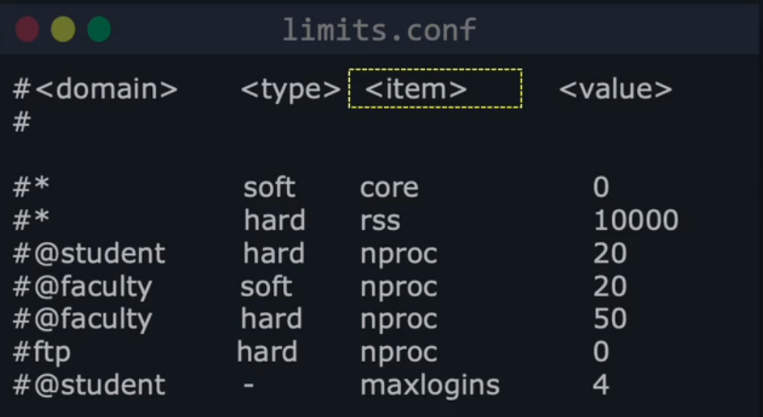
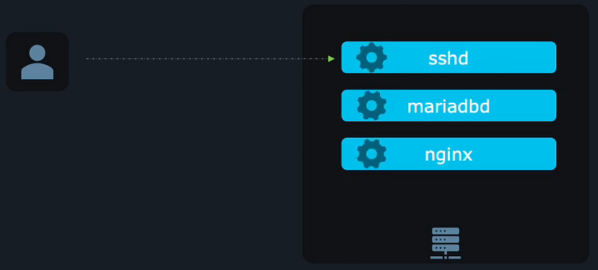
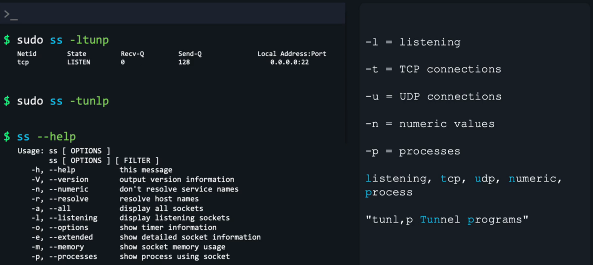
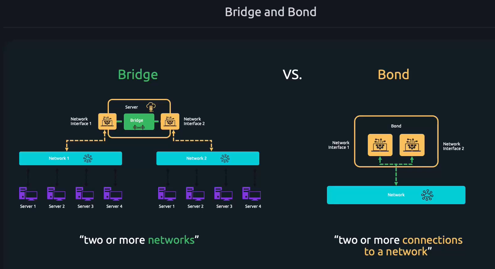
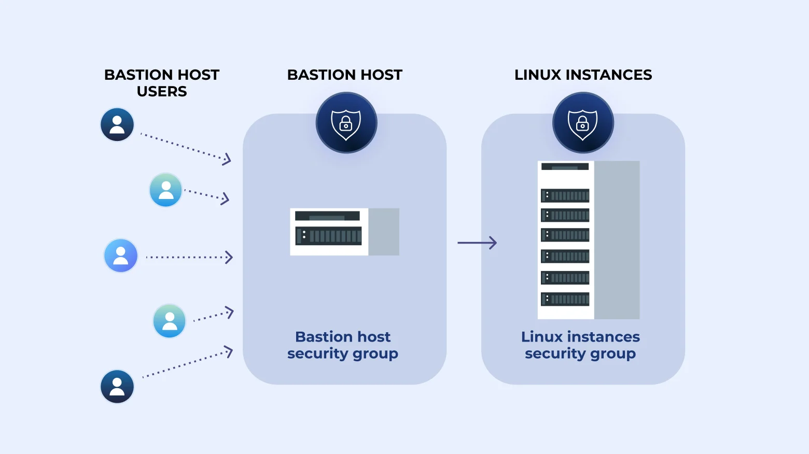

# Linux Foundation Certified System Administrator (LFCS)

## Table of Contents
- [Curriculum](#curriculum)
- [Essential Commands](#essential-commands)
- [Operations Deployment](#operations-deployment)
- [Users and Groups](#users-and-groups)
- [Networking](#networking)
- [Storage](#storage)
- [CLI Commands](#cli-commands)
- [Notes](#notes)

## Curriculum
> - Essential Commands **20%**
> - Operations Deployment **25%**
> - Users and Groups **10%**
> - Networking **25%**
> - Storage **20%**

## ***Essential Commands***

> ### Login To Remote & Local GUI-Text Mode Console
- Types:
    - Local Text Mode/ GUI Mode
    - Remote Text Mode via `SSH Client & Daemon`/ GUI Mode via `VNC- virtual network computing`
---

> ### Use System Documentation
- `--help`: Get short help page for a command
- `man`: Get Full help page the documentation of command.
    - Contain sections 1 to 8
    - Contain command in section *1* & *8*
---

> ### Management for File & Directories
- `Absolute path`: A full path from the root of the filesystem, start with `/`.
- `Relative Path`: Starts from the current working directory.
- Commands:
```bash
pwd             # Current working dir
cd /            # Go to root dir
cd -            # Go to previous dir
cd ~            # Go to Home dir
cd ..           # Go to up level of the dir tree 
touch file      # Create a file
mkdir dirname   # Create a directory
cp [src] [dis]  # Copy file to location, add -r for copy dir
mv [src] [dis]  # mv file to location or Rename it
rm name         # remove file, add -r for dir           
```
---

> ### Soft Links & Hard Links
- `Hard Link Process`: link files to Inode 
    - No hard links to dir
    - No hard links between diff filesystem
- `Inode`: 
    - A number that represent a file stored in a system
    - This inode contain metadata of the file 
    - Unique per file
- `Soft Link`: Act as shortcut for files & dirs
    - Soft links between diff filesystem

> ### File Permissions
- Only the owner of a file can change its permissions
```text
  -        rwx        rwx          rwx
[type] [owner_'u'] [group_'g'] [others_'o']
u+[list_of_perm]
u-[list_of_perm]
u=[list_of_perm]
(u=rwx,g=,o=x) == (701)
```
- Commands:
```bash
groups                  # List groups 
chgrp groupname file    # Change group of file
chown ownername file    # Change user of 
chown owner:group file  # Change owner & Group
chmod perms file/dir
```
---

> ### SUID, SGID, Sticky Bit
- `SUID`: Allow user to run an executable with perm of the executable file Owner
- `SGID`: Allow user to run an executable file/dir with perm of the executable file/dir Group
-  `Sticky Bit`: Restrict file deletion in a dir, Only file owner or group owner or root can delete it
- If special permissions are set but  the corresponding execute permissions are missing, they will not be effective.
    - `rwSrwsr-T` --> only the SGID will be effective & maybe Sticky Bit
```bash
chmod 4xxx file             # set SUID
chmod 2xxx file             # set SGID
chmod 6xxx file             # set SUID & SGID
chmod 1xxx file             # Set Sticky Bit
```
---

> ### Searching Files
- Commands: find /path/to/search/in/ <options> file

```bash
# Options(name) 
find /usr/share -name '*.jpg'               # search file name end with jpg  case sensitive  
find /usr/share -iname kary.txt             # search file name kary.txt no case sensitive
# Options(size)
find /usr/share -size +10M                  # search size more 10M
# Options(perm)
find -perm 664                              # search with perm exactly 664
find -perm u=rw                             # search with perm exactly u=rw
find -perm -664                             # search with at least perm 664
find -perm /664                             # search with any of perm 664
# Options(mmin)
find /usr/share -mmin 3                     # modified from 3 mins
find /usr/share -mmin -3                    # modified within prev 3 mins
find /usr/share -mmin +3                    # modified more that 3 mins back
# Options(cmin)   
find . -cmin -5                             # Changed within prev 5 mins
# Combining more than one option
find -name kary -size +100k                 # search name kary AND size more 100k
find -name kary -o -size +100k              # search name kary OR size more 100k
find -not -name kary                        # search not name kary 
```
---

> ### Manipulate File Content
- Display File Content:
    - Normal display: `cat`, `tac`, `tail`, `head` 
    - Sorted & Uniq: `sort`, `uniq`
    - Portion of line: `cut` 
    - File diff: `diff`, `sdiff`  
- Transform File Content:
    - Stream Editor: `sed`
```bash
# Display File Content
cat                         # Display File Content top -> Bottom 
tac                         # Display File Content Bottom -> top
tail -n 30                  # Display tail of File (last 30 lines)
head -n 20                  # Display head of File (first 20 lines)

cut -d ',' -f 2 file        # Display portion of each line, '-d'--> Delimiter, '-f' --> field
sort file | uniq            # Sort content and show uniq values
diff -y file1 file2         # show files diff
sed -i 's/cary/kary/g' file    # replace every match of cary to kary, , 's' --> substitutes 'g' --> Global(all matches), -i --> in place 
less file                   # Display and search file in pages
more file                   # Display file in pages
```
---

> ### Search File Using Grep
```bash
grep [options] 'search_Pattern' file
# -i Case inessive
# -v Revert 
# -n Show line numbers
# -r Recursive for dir
# -w specific batten
# -c count
# -q option tells grep to run quietly (or silently).
# -E use RegEx
# --color Highlight matching text
grep -ir 'password' /dir/           # Search case insensitive of word password in dir and sub dir
```
---

> ### Analyze Text Using RegEX
- RegEx:
    - `^`: Match text with *start* pattern
    - `$`: Match text with *end* pattern
    - `.`: Match *any* char
    - `\`: *Escape* the next char
    - `*`: *0 or more* char appearance 
    - `+`: *1 or more* char appearance
    - `?`: *0 or 1* char appearance
    - `|`: pattern | pattern, act as OR
    - `{n,m}`,`{x}`: pattern char of min=n & max=m occurrence, or Exact x times
    - `[range]`: [a-z] match a to z
    - `[^]`: Negated Ranges
    - `()`: SubExpressions Group
- Using `egrep` or `-E`: to use RegEx in matching pattern using grep
---

> ### Archive, Back Up, Compress
- When we backup our data we archive it into a file then compress this file.
#### Archive
- `Command:` **.tar**: 
    - `-tf`: --list --files
    - `-cf`: --create --file
    - `-rf`: --append --file
    - `-xf`: --extract --file
    - `-C`: --directory
    - `-z`: --gzip
    - `-j`: --bzip
    - `-J`: --xz
    - `-a`: --autocomplete
```bash
tar -tf archive.tar
tar -cf archive_name.tar files/dir
tar -rf archive_name.tar files/dir
tar -xf archive_name.tar
tar -xf archive_name.tar -C desired_path

tar -czf archive.tar.gz files
tar -cjf archive.tar.bz2 files
tar -cJf archive.tar.xz files

tar -caf archive.tar file_or_directory

 ```

#### Compress
- Tools that compress single file: `gzip`, `bzip`, `xz`
- `Command:` **.gz**, **.bz2**, **.xz** : 
    - `-k`: --keep
    - `-l`: --list
- Tools that compress more that one file: `zip` 
- `Command:` **.zip** : 
    - `-r`: recursive for folders
```bash
# gzip tool
gzip file
gunzip file.gz
# bzip tool
bzip2 file
bunzip file.gz
# xz tool
xz file
unxz file.gz
# zip
zip archive file
zip -r archive /dir/
```

#### Backup
```bash
# Backup Dir to another machine using ssh daemon or to same machine
rsync -a dirORfile/ backupsDIR/
rsync -a dirORfile/ kary:ip.to.ssh.machine:path/to/location
# Disk Image
sudo dd if=/input/disk of=/output/image.raw bs=1M --status
```
---

> ### Input/Output Redirection
- `<`: input redirect (stdin)
- `<<EOF text EOF`: End of file signal
- `bc <<<1+2+3`: Here String
- `>`, `1>`: redirect output overwrite the file (stdout)
- `>>`, `1>>`: output append to file (stdout)
- `2>`: output direct error of the output and overwrite (stderr)
- `2>>`: output direct error of the output and append (stderr)
- `1> output.txt 2>&1`, `&> output.txt`: direct output to file and direct error to the output too
- `|`: Piping the output of command  to another command
```bash
cat < file.txt 

sort file > output
sort file 1> file2 2> error
sort file &> output

cat file.txt | grep "hello"
cat <<EOF
line1
line1
EOF

#!/bin/bash
cat <<EOF > myfile.txt
Line 1: Hello
Line 2: This is a test
EOF
```
---

> ### SSL/TLS
```bash
# Create a Private Key
openssl genrsa -out my.key 2048
# Create Signing Request
openssl req -new -key my.key -out my.csr -subj "/CN=mydomain.com/O=myorg"
# Sign Cert by CA
openssl x509 -req -in my.csr -CA ca.crt -CAkey ca.key -CAcreateserial -out my.crt -days 365
# Display Cert Details
openssl x509 -in my.crt -noout -text
# Verify Cert
openssl verify -CAfile ca.crt my.crt
```

## ***Operations Deployment***
> ### Boot, Reboot, and Shutdown a System
```bash
sudo systemctl reboot
sudo systemctl reboot --force             #Force reboot
sudo systemctl reboot --force --force     #Last Option to do when reboot

sudo systemctl poweroff 
sudo systemctl poweroff --force

sudo shutdown 02:00                       #Shutdown at 2 am
sudo shutdown +30                         #Shutdown after 30 mins
sudo shutdown -r +15 'message to appear when reboot'    #Reboot after 15 mins with message
```
- Boot Options and system Info:
- OLD version of systemd used runlevel:

| Runlevel | Description|
| -------- | -----------|
| 1 | Single-user mode (rescue/maintenance) |
| 3 | Multi-user, console login only        |
| 5 | Multi-user, graphical (GUI) login     |

- New systemd use target Options of system-default when accessing:
    - `graphical.target`: Full system with graphical UI 
    - `multi-user.target`: Non-graphical, multi-user environment.
    - `rescue.target` & `emergency.target`: Minimal single-user environment with basic or No services.
```bash
sudo systemctl get-default                       # Check current default target
sudo systemctl set-default multi-user.target     # Set a new default target 
sudo systemctl isolate option.target             # Switch to a specific target 
```
---

> ### Manage Startup & Run and Services
- We will talk about Service Units
- Service unit exist in `/lib/systemd/system/name.service`
```bash
sudo systemctl cat ssh.service                   # view svc unit
sudo systemctl edit --full ssh.service           # Edit svc unit
sudo systemctl status ssh.service                # Status svc
sudo systemctl stop ssh.service                  # Stop svc
sudo systemctl start ssh.service                 # Start svc
sudo systemctl restart ssh.service              # Restart svc -> service disturbance
sudo systemctl reload ssh.service                # Reload svc -> No service disturbance
sudo systemctl reload-or-restart ssh.service     # Try to reload svc, if fail, it will restart
sudo systemctl enable ssh.service                # Enable start service on boot
sudo systemctl enable --now ssh.service          # Enable start service on boot and start it now
sudo systemctl disable ssh.service               # Disable start service on boot
sudo systemctl mask ssh.service                  # Safe lock to not start or enable svc without unmask it
sudo systemctl mask ssh.service                  # Unmask svc to start or enable 
sudo systemctl list-units --type service --all   # List all service units 
sudo systemctl daemon-reload                     # Reload our Systemd daemon
```
- Create a Service:
```shell
cat myapp.service << EOF
[Unit]
Description=My description
Documentation=
After=depended.service

[Service]
ExecStartPre=echo"myapp pre start"
ExecStart=path/to/script/service
KillMode=process
Restart=always
RestartSec=1
Type=simple

[Install]
WantedBy=multi-user.target
Alias=app2.service
EOF
```
---

> ### Diagnose and Manage Processes
- View Process and Resource Usage:
```bash
ps                          # Current shell processes
ps a                        # All processes associated with terminals
ps u                        # Show by user-oriented format
ps aux                      # Show all processes system-wide 
ps aux --sort=-%mem         # Show process sorted by memory    
ps l                        # Long output more details
ps f                        # Show hierarchical view of processes
ps p                        # List process of pid
ps u pid                    # List more details about process of pid 
ps -U kary                  # List process of user kary
pgrep -a proc_name          # Search processes by name 
top                         # Real-time process monitor
htop                        # Enhanced 'top' with better UI 
```

- `Niceness of a process`:
    - Niceness controls priority of processes.
    - Range: -20 (highest priority) to 19 (lowest priority).
```bash
# nice -n [nice_value] [command/proc]
# renice [nice_value] [proc_PID]
#-------------------------------------
nice -n +11 bash                        # Start bash with low priority
renice 7 11332                          # Change priority of process 11332 to 7
```

- `Killing Process`:
```bash
# kill -singal proc_pid
# pkill -signal proc_name
#--------------------------
kill -L                     # Show available signals
kill -singal proc_pid
pkill -signal proc_name

kill -15 1234         # Politely stop process 1234
kill -9 1234          # Force kill process 1234
kill -1 1234          # Reload config of process 1234
kill -19 1234         # Pause process 1234
kill -18 1234         # Resume process 1234
```

- Process on `Background & Foreground`
```bash
[Ctrl+Z]          # suspend (pause) current running process in terminal
command &         # Run Command in background
jobs              # List background or paused jobs
bg                # Resume it in background
fg [n]            # Bring it to foreground, [n] optional to specify the job to return it to fg
```

- `lsof` = List Open Files:
```bash
lsof -u kary                # Show all open files by user `kary`          
lsof -p 1234                # Show files opened by process with PID 1234  
lsof /etc/passwd            # Show who is using `/etc/passwd`             
```
---

> ### Locate and Analyze System Log Files
- `journalctl` reads logs collected by systemd-journald
- Status Error Warning Messages:
- Location: `/var/log/`
- 
```bash
sudo journalctl -u nginx            # Show logs for the nginx service
sudo journalctl -p err              # Show only error-level logs
sudo journalctl -p info -g '^c'     # Show info-level logs matching regex '^c'
sudo journalctl -b                  # Show logs since the last boot
sudo journalctl -S "2024-06-01" -T "2024-06-15"  # Show logs between specific dates   
last                                # History who log into system
lastlog                             # Show the most recent login of all users
```
---

> ### Schedule Tasks

+ ***Cron***         (can schedule task to every minutes)
- System wide Table: Path:`/etc/crontab`
```scss
* * * * *  command_to_run
│ │ │ │ │
│ │ │ │ └── Day of Week (0 - 7) (Sunday = 0 or 7)
│ │ │ └──── Month (1 - 12)
│ │ └────── Day of Month (1 - 31)
│ └──────── Hour (0 - 23)
└────────── Minute (0 - 59)
```
- Syntax:
    - `*`: Means "every" value in that position.
    - `,`: Means multiple individual values in a single field. : 0 9,17 * * * → Run at 9:00 AM and 5:00 PM every day
    - `-`: Means a range of values. : 0 9-17 * * * → run on the hour from 9 AM to 5 PM
    - `/`: Means "every Nth" value, starting from the leftmost number. : */5 * * * * → run every 5 minutes
- Alternative:
    - Create a script and add it to one of these paths
    - `/etc/cron.hourly/`, `/etc/cron.daily/`, `/etc/cron.monthly/`, `/etc/cron.weekly/`
```bash
crontab -e               # Edit your own cron jobs
crontab -l               # List your own cron jobs
crontab -r               # Delete your own cron jobs
sudo crontab -l -u mac   # List cron jobs of user "mac"
sudo crontab -l          # List cron jobs of root user
```
+ ***Anacron***      (can schedule task to every days only)
+ at           (Task should run once )
---

> ### Software Package Manager
- For Debian:
    - `dpkg` & `apt`
```bash
apt update 
apt upgrade
apt install nginx
apt autoremove nginx
apt search  nginx
```
---

> ### Configure the Repositories of Package Manager
- Path: `/etc/apt/source.list`
- This contain a list of repos that have packages to be installed
- In case of Installing package that is not the official repo of Ubuntu
    - Install Public Key
    - Convert its formate to binary by `gpg --dearmor`
    - Move the key to the apt keys dir ***`etc/apt/keyrings/`***
    - Define a source file for our package in /etc/apt/source.list.d/custom.list
```scss
deb [signed-by=/etc/apt/keyrings/custom.gpg] https://to/the/custom/repo/ <codename> <component>
```
---

> ### Availability of Resources and Processes
```bash
df -h
du -sh
free -h
lscpu 
lspci
```
---

> ### Change Kernel Runtime Parameters, Persistent and Non-Persistent
- Kernel parameters at runtime are configuration values that control how the Linux kernel behaves while the system is running
- Path for make a change for this Parameters permanent `/etc/sysctl.conf`
- Another way is by adding file contain the updated value in the dir `/etc/sysctl.d/*.conf`
```bash
sudo nano /etc/sysctl.conf                  # Permanent edit a parameters
sudo sysctl -p /etc/sysctl.d/custom.conf    # Immediately adjust parameters
```
---

> ### SELinux File and Process Contexts
- SELinux is Mandatory Access Control (MAC) system that uses contexts (labels) to control access.
```scss
user:role:type:level

```
- Policy Types
    - Targeted Policy (most common): Constrains only specific high-risk daemons (e.g., httpd, sshd). Other processes run unconfined.
    - MLS (Multi-Level Security) Policy: Supports hierarchical sensitivity levels. Used in environments with strict classification requirements.
- Enforcement Modes
    - Enforcing: Policies are enforced—violations are blocked and logged
    - Permissive: Violations are logged but not blocked.
    - Disabled: SELinux is turned off entirely.
---


> ### Manage and Configure Virtual Machines
- In Linux we use (QEMU-KVM):
    - Quick Emulator, Kernel-base virtual Machine
- Tools: `sudo VIRSH` = **Manage Virtual Machine from command line**

```bash
sudo apt install virt-manager
sudo virsh define vm-config.xml      # Define a new VM from XML without starting it
sudo virsh list --all 
sudo virsh start my-vm               # Boot a defined but stopped VM
sudo virsh reboot my-vm              # Soft reboot 
sudo virsh reset my-vm               # force reset 
sudo virsh shutdown my-vm            # Graceful shutdown
sudo virsh destroy my-vm             # Force-off like pulling the plug
sudo virsh undefine --remove-all-storage my-vm            # Delete domain vm
sudo virsh autostart my-vm           # Autostart vm when boot
sudo virsh dominfo my-vm             # Info about vm
sudo virsh setmaxmem my-vm 100M --config --maximum  # Set max Memory to 100M
sudo virsh setmem my-vm 100M --config   # Set memory to 100M

sudo virsh setvcpus my-vm 2 --config --maximum  # Set max cpu to 2 
```
- Create and Boot a Virtual Machine:
    - Step 1: Download small cloud image 
    - Step 2: Move it to `/var/lib/libvirt/images`
    - Step 3: Create VM with virt-install
    - Step 4: inject a password directly into the image
```bash
wget https://cloud-images.ubuntu.com/minimal/releases/focal/release/ubuntu-20.04-minimal-cloudimg-amd64.img
sudo mv ubuntu-20.04-minimal-cloudimg-amd64.img /var/lib/libvirt/images/ubuntu-min.qcow2
sudo chown libvirt-qemu:kvm /var/lib/libvirt/images/ubuntu-min.qcow2
virt-install --name ubuntu-min --memory 1024 --vcpus 1 --disk path=/var/lib/libvirt/images/ubuntu-min.qcow2,format=qcow2 --import --os-type linux --os-variant ubuntu20.04 --network network=default --noautoconsole
sudo apt install libguestfs-tools
sudo virt-customize -a /var/lib/libvirt/images/ubuntu-min.qcow2 --root-password password:root123

 sudo virsh console my-vm       # Access the vm cli
```


---

## ***Users and Groups***
### Users
- When a user created:
    - **user** created 
    - **Group** Created with same name of user
    - **Dir** created `/home/username`
    - default terminal `/bin/bash` with `.bashrc`
- User details stored in `/etc/passwd`
    - Use `whoami`, `id`
```bash
sudo adduser john                           # Create new user
sudo adduser --shell /path/to/shell john    # Create new user with custom shell
sudo adduser --home /path/to/home john      # Create new user with custom home dir
sudo adduser --uid 1213 john                # Create new user with custom user id 
sudo adduser --system apachedev             # Create Service User account

sudo passwd john                            # Set password to user
sudo passwd -l root                         # lock password based login to the root 
sudo passwd -u root                         # unlock password based login to the root
sudo usermod -d /pathtohome john            # Modify user home dir
sudo usermod -l jane john                   # Modify login username
sudo usermod -s /pathtoshell john           # Modify user shell 
sudo usermod -g developer john              # Modify user primary group (--gid)
sudo usermod -G jane john                   # Modify user Secondary group 
sudo usermod -e 2030-03-01 jane             # Set the jane user account to expire
sudo usermod -e "" jane                     # No expire data

sudo chage -d 0 john                        # Set the password of john to expire
sudo chage -M 30 john                       # user have to change its password ones very month
sudo chage -W 2 jane                        # gets a warning at least 2 days before the password expires.
sudo userdel john                           # Remove user and group with name john only
sudo userdel -r john                        # Remove user and group with name john & the home dir of user

whoami                                      # Current Username
id                                          # Current User Details
id john                                     # john user details

sudo login john                             # Login as john
sudo -i                                     # Login As root if user in sudo
su -                                        # Login as root by typing root pass

```
---

### Groups
- Each user can belong to multiple groups:
    - Primary: first one
    - Secondary: the rest of groups'
- Manage groups:
    - create groups -> `groupadd`
    - add/remove users from groups -> `gpasswd`
    - modify group -> `groupmod`
    - delete group -> `groupdel`

```bash
sudo adduser john                           # Create new user
sudo groupadd developers                    # Create new group
sudo groupadd --gid 9875 cricket            # Create new group with custom group id

sudo gpasswd -a john developer              # Add user to group
sudo gpasswd -d john developer              # remove user to group

sudo usermod -g developer john              # Modify user primary group (--gid)
sudo usermod -G jane john                   # Modify user Secondary group 
sudo usermod -aG developers jane            # Add user to group as secondary

sudo groupmod -n programers developer       # Modify Group name
sudo groupdel programers                    # Delete a group (wont work if user use it as primary group)     

groups john                                 # Show the groups that john belong to
```
---

###  System-Wide Environment Profiles
- Environment variables is variable set to a values to make it easy to user it as defaults
    - EX: `PATH`, `HOME`
- User edit Own Env variables:
    - update `.bashrc`
- Set Env for each user login:
    - update `/etc/environment`
```bash
env                                 # Show Current user environment
echo $HOME                          # Print the HOME value
PATH=$PATH:/usr/local/bin           # Update the path for current shell only
export PATH=$PATH:/usr/local/bin    # Updated path is exported to any subprocess 

sudo nano ~/.bashrc                 # Open bashrc
export MYVAR=TRUE                   # Update or add env
sudo source ~/.bashrc               # apply changes
```
- If we want to run a command each time user login:
    - add script to `/etc/profile.d/script.sh`
---

### Manage Template User Environment
- If we want to create a template for new user home directories.
- When a new user is created files in `/etc/skel` are copied into their home directory.
    - add readme `sudo nano /etc/skel/README`

### Configure User Resource Limits
- update `/etc/security/limits.conf` to manage resource limits allocated to each user:
    - Or user `ulimit -a`
    - User can lower there usage not increase it 
- Manipulate Resource Limits for users & Groups
<div style="text-align: center;">

</div>

---

### Manage User Privileges
- manage user privilege like manage sudo group
- Update the  `/etc/sudoers` file, contain four fields:
    - User/Group
    - Host
    - RunAsUser, RunAsGroup
    - Commands
```bash
sudo EDITOR=nano visudo

# User/Group host=(run_as_user,run_as_group) command_list

john ALL=(ALL,ALL) ALL
%dev ALL=(ALL,ALL) ALL
john ALL=(ALL,ALL) /bin/ls

john    ALL=(ALL)   NOPASSWD: ALL           # User john can run all command without providing the passwd
%salesteam    ALL=(ALL)   ALL               # Group salesteam run all command
trinity   ALL=(sam)   ALL                   # User trinity run all command as sam
```
### To administrate User Management accross many servers
- Use LDAP User and Group Accounts for centrally create/use User
- Pluggable Authentication Module (PAM) `sudo pam-auth-update`
---

## ***Networking***

### Configure IPv4 and IPv6 Networking and Hostname Resolution
- > IPv4 (32 bits)
-  `CIDR - Classless Inter-Domain Routing`: 
    - **192.168.1.0/24**: 
        - The first 24 bits is network Prefix 
        - Rest of 32 is devices in network = 8 bits
        - 192.168.1.0 -> 192.168.1.255
        - Total Useable IPs is (2^8 - 1)
        - One IP for Router, One IP for broadcast
- To apply Temporary changes we use `ip commands`
- To apply permanent changes we use `netplan config files`
    - Create custom network config for interfaces at `/etc/netplan/myconfig.yaml`

```bash
ip link                                 # Shows networking devices/network interfaces
ip route                                # Show routing tables for interfaces
ip addr                                 # Display ip address configured for network interfaces
ip -c addr                              # Display Colored ip address config 

ip link set dev eth0 up                 # Set the eth0 interface to be UP 
ip link set dev eth0 down               # Set the eth0 interface to be DOWN 

ip addr add 10.0.0.10/24 dev eth0       # Adding IPv4 address for eth0 interface
ip addr delete 10.0.0.10/24 dev eth0    # Adding IPv4 address for eth0 interface

sudo nano /etc/netplan/my-netsettings.yaml
sudo netplan get                        # Get network setting 
sudo netplan apply                      # Applay network setting 
sudo netplan try                        # try network setting before apply it
```

- mynetplansetting.yaml
```yaml
network:
version: 2
  ethernets:
    enp0s8:
      dhcp4: false
      dhcp6: false
      addresses:
        - 10.0.0.9/24
        - fe80::921b:eff:fe3d:abcd/64
      nameservers:
        addresses:
          - 8.8.4.4
          - 8.8.8.8
      routes:
        - to: 192.168.0.0/24
          via: 10.0.0.100
        - to: default
          via: 10.0.0.1
```

---

### Manage DNS settings when your system is using systemd-resolved
- Use Tool `resolvectl` to see interfaces DNS resolvers
- Update the global DNS resolvers at `/etc/systemd/resolved.conf`
- For config DNS manually resolve hostnames for spesific IPs at `/etc/hosts`

```bash
resolvectl status                           # Shows system-wide DNS config
resolvectl dns                              # Shows the DNS servers assigned to each network interface
sudo nano /etc/systemd/resolved.conf        # Update glober dns resolve config
sudo systemctl restart systemd-resolved.service
```

- List for DNS Config places in Linux System

| Location/Tool                 | Purpose                   |
| ----------------------------- | ------------------------- |
| `/etc/netplan/*.yaml`         | Static DNS via Netplan    |
| `resolvectl`                  | systemd-resolved control  |
| `/etc/resolv.conf`            | Legacy or stub resolver   |
| `/etc/hosts`                  | Manual host-to-IP mapping |

---

### Start, Stop, and Check Status of Network Services
<div style="text-align: center;">

</div>

- In order to check our services that use network and ports we use this tools:
    - `ss` & `netstat`
    - Use flages ***-tunlp***

<div style="text-align: center;">

</div>


### Bridge and Bonding Devices

- > Bridge	Virtual switch for VMs/containers
    - A network bridge connects a virtual network (like VMs or containers) to a physical network. 
    - It acts like a virtual switch.
```yaml
network:
  version: 2
  ethernets:
    enp0s3: {}  # Don't assign IP directly

  bridges:
    br0:
      interfaces: [enp0s3]
      dhcp4: true
```
- > `Bond`
- Network Interface Card NIC bonding combines two or more network interfaces into one logical interface for:
    - Failover (high availability)
    - Increased bandwidth (via load balancing)
```yaml
network:
  version: 2
  bonds:
    bond0:
      interfaces: [enp0s3, enp0s8]
      parameters:
        mode: active-backup
      addresses:
        - 192.168.1.100/24
      gateway4: 192.168.1.1
      nameservers:
        addresses: [8.8.8.8, 1.1.1.1]
```

<div style="text-align: center;">

</div>

---

### Configure Packet Filtering (Firewall)
- Using `ufw`:
    - This tool define rules to allow/deny the in/out traffic
    - By default it deny all traffic
    - It process rules from top to buttom (Order matters)


```bash
sudo ufw status                                     # Show ufw status
sudo ufw status verbose
sudo ufw status numbered                            # Show firewall status & List rules numbered

sudo ufw allow 22                                   # Allow traffic on port 22
sudo ufw deny 555                                   # Deny traffic on port 555
sudo ufw deny 443/tcp                               # deny incoming traffic on port 443, through the TCP protocol
sudo ufw enable                                     # Enable ufw firewall

sudo ufw delete 1                                   # Delete rule number 1
sudo ufw delete allow 22                            # Delete rule that allowed traffic on port 22

sudo ufw allow from 192.168.56.100 to any port 22   # allow incomming traffic on port 22 from specific IP
sudo ufw insert 1 deny from 10.0.0.10               # add rul in specific orded number

sudo ufw deny out on eth0 to 8.8.8.8                # Deny out traffic from eth0 to ip 8.8.8.8

sudo ufw allow in on eth0 from 10.0.0.120 to 10.2.63.53 proto tcp   # allow traffic on eth0 ip 10.2.63.53 from 10.0.0.120
```

### Port Redirection and Network Address Translation (NAT)

- When we sutup bastion server that make our internal servers can access and be accessed from the internet
- It asks as Router, It accept incomming connection and forward it to the right server by manipulating the src and dist IPs

<div style="text-align: center;">

</div>

---

- > Port Redirection
- Enable port forwarding in `/etc/sysctl.conf` or `/etc/sysctl.d/99-sysctl.conf`
```bash
# uncomment ipv4.forward=1
sudo sysctl -system

sudo iptables -t nat -A PREROUTING -i enp1s0 -s 10.0.0.0/24 -p tcp --dport 8080 -j DNAT --to-destination 192.168.0.5:80
sudo iptables -t nat -A POSTROUTING -s 10.0.0.0/24 -o enp6s0 -j MASQUERADE

sudo netfilter-presistent save
sudo apt install iptables-persistent

sudo iptables --list-rules --table nat
sudo iptables --flush --table nat

```

### Implement Reverse Proxies and Load Balancers
- We will use nginx as reverse proxie and load balancer
```bash
sudo apt insatll nginx
sudo nano /etc/nginx/site-available/proxy.conf
sudo cat /etc/nginx/proxy_params
# to enable conifg we should copy/softlink it to site-enabled
sudo ln -s /etc/nginx/sites-available/proxy.conf /etc/nginx/sites-enabled/proxy.conf
# Also we should disable default config
sudo rm /etc/nginx/sites-enabled/default
# Test config & Reload
sudo nginx -t
sudo systemctl reload nginx

```
- > Proxy config:
```scss
server{
    listen 80;
    location /{
        proxy_pass http://1.1.1.1;
        include proxy_params;
    }
}
```
- > Loadbalancer config:
```conf
# /etc/nginx/sites-available/loadbalancer.conf

upstream backend {
    least_conn;
    server 192.168.0.101;
    server 192.168.0.102 weight=2;          # Give more weight for this server
    server 192.168.0.103 backup;            # Use this as backup if server goes down
}

server {
    listen 80;
    server_name yourdomain.com;

    location / {
        proxy_pass http://backend;

        proxy_set_header Host $host;
        proxy_set_header X-Real-IP $remote_addr;
        proxy_set_header X-Forwarded-For $proxy_add_x_forwarded_for;
        proxy_set_header X-Forwarded-Proto $scheme;
    }
}
```

### Set and Synchronize System Time Using Time Servers
- Devices get the right time from `NTP` servers *Network time protocol*
- On Ubuntu this is the responsibility of `systemd-timesyncd`
- To edit the config of ntp server edit `/etc/systemd/timesyncd.conf`
```bash
timedatectl set-ntp true
timedatectl list-timezones                          # List timezones
timedatectl set-timezones America/Los_Angeles       # Set timezone to amertica
timedatectl                                         # Show current timezone

```

### SSH Servers and Clients
- we should install ssh-client in a machine and install ssh-server(Daemon) on the other to be able to access it.
- > ***SSH Server***
- Edit ***Server Daemon*** Config `/etc/ssh/sshd_config` 
- Additional custom config at `/etc/ssh/sshd_config.d/custom.conf`


- `Configuration` ***Server/Deamon***:
    - *Port*
    - *AddressFamily*: IPv4 == inet, IPv6 == inet6 
    - *ListenAddress*: what ip shold the ssh listen or able to connect on.
    - *PasswordAuthentication*: auth using password
    - *KbdInteractiveAuthentication*: read password from interactive keyboard
    - *X11Forwarding*: Allows run graphical app from a remote server on their machine by SSH.
    - *Match User mac*: to use custom config for specific user `mac`

- > ***SSH Client***
- Edit ***Client*** Config `/etc/ssh/ssh_config` *Global*
- At User Dir we have `~/.ssh` dir for the use of ssh client
- Additional custom config at `/etc/ssh/ssh_config.d/custom.conf`
- To elimainate the remembering or user@ip: use ~/.ssh/config
- `~/.ssh/config`:
```conf
Host machinename-custom
    HostName 12.0.0.10
    Port 22
    User mac
```
- To make password Authentication available you should:
    - Enable `PasswordAuthentication` & `KbdInteractiveAuthentication`
- To use keys:
    - Create keypair
    - send public key to autorizedkeys to the daemon machine at `.ssh/authorized_keys` of user HOME

- In case we use keys to authenticate
```bash
ssh-keygen 
ssh-copy-id 
ssh-copy-id -i /pub/key/path user@hostname
```
---

## ***Storage***
- > The process of using a Disk as storage
    - Identify the Disk
    - Partition the Disk
    - Format the partition with a filesystem
    - Create a Mount Point
    - Mount the formatted partition to the mount point


### List, Create, Delete, and Modify Physical Storage Partitions
- Ubuntu use `EXT4` as file system 

```bash
lsblk                           # Show the block devices
sudo cfdisk                     # Manage disk partition using gui
```

### Configure and Manage Swap Space
- Swap space is when your system swap a space of ram to your hard disk to optimize using ram and performance
```bash
swapon --show
sudo mkswap /swap
sudo swapon --verbose /swap
sudo mkswap /dev/vdb3
sudo swapon --verbose /dev/vdb3 
swapoff /swap
```

### Create and Configure File Systems
- In order we want to store files on a partition we need a file system for this partition
- For Debian File Systems: `EXT4`
- For RedHat File Systems: `XFS`
- We use another tools for managing filesystem manipulation
```bash
sudo mkfs.ext4 /dev/sbc1
sudo mkfs.ext4 -L "backup" -i size=512 /dev/sbc1        # Create ext4 file system with lable and inode size
sudo tune2fs -l /dev/sbc1
```
### Configure Systems to Mount Filesystems at or During Boot
- Auto-mount: Edit `/etc/fstab`
    - devicename _ mountpoint _ filesystemtype _ mountoptions _ 0 _ [0,1,2] 
```bash
sudo mount /dev/vdb1 /mnt/custom
sudo umount /mnt/custom
```

### Filesystem and Mount Options
- Command `findmnt`
```bash
findmnt -t xfs,ext4                                     # Find mount point with type xfs and ext4
sudo mount -o ro,noexec,nosuid /dev/vbd /mnt            # Mount new fs with custom options (readonly)
sudo mount -o remount,rw,noexec,nosuid /dev/vbd /mnt    # remount fs with custom options
```

### NFS Server & Client
- Steps:
    - [Server]: Install the NFS server
    - [Server]: edit the `/etc/exports` with dir & ip(permissions)
    - [Server]: Export the directory    
    - [Client]: Install nfs client
    - [Client]: Mount the nfs shared folder/dir
```bash
sudo apt install nfs-kernel-server          # Server
sudo apt install nfs-common                 # Client
nano /etc/exports                           # Export file
sudo exportfs -r
sudo exportfs -v

sudo mount 192.168.56.150:/home/macarious/testnfs /home/vagrant/testmount
```
### Use Network Block Devices: NBD
```bash
sudo apt install nbd-server
sudo nano /etc/nbd-server/config
cat >>EOF
[partition2]
    exportname=/dev/sbd1
EOF
sudo systemctl restart nbd-server 

sudo apt install nbd-client
sudo modprobe nbd
sudo nbd-clent ip/hostname -N identifier_of_export_block_device 
sudo nbd-clent -l ip/hostname
sudo nbd-clent -d
```

### Manage and Configure LVM Storage
<div style="text-align: center;">

</div>
- PV Physical Volumn
- VG Volumn Group
- LV Logical Volumn
```bash
sudo apt install lvm2
sudo lvmdiskscan
sudo pvcreate /dev/sbc
sudo pvremove /dev/sbc
sudo pvs
sudo vgcreate my_volumn /dev/sdb /dev/sdw
sudo vgextend my_volumn /dev/sdd
sudo vgreduce my_volumn /dev/sdd
sudo lvcreate --size 2G --name mac my_volumn
sudo lvresize --extents 100%VG my_volumn/mac
sudo lvresize --resizefs --size 10G my_volumn/mac

sudo lvdisplay
```
<div style="text-align: center;">

</div>

### Labs
```bash
sudo mkfs.xfs -L "DataDisk" /dev/vdb
sudo mkfs.ext4  -N 2048 /dev/vdc
sudo mount /dev/vdb /mnt/
sudo umount /mnt
lsblk -f
fdisk -l 
sudo tune2fs -L "MyLabel" /dev/vdb
xfs_admin -L "SwapFS" /dev/vdb

sudo mount -o ro,noexec,nosuid /dev/vdb1 /mnt/
mount -o remount,rw /dev/vdb1 /mnt

pvcreate /dev/vdc
pvremove /dev/vdc
sudo vgcreate volume1 /dev/vdb
sudo vgextend volume1 /dev/vdc
sudo vgreduce volume1 /dev/vdc
lvcreate --size 0.5G --name smalldata volume1
lvresize --size 752M volume1/smalldata
sudo mkfs.xfs /dev/volume1/smalldata
lvremove volume1/smalldata
```

### Monitor Storage Performance
```bash
getfacl archive
setfacl --modify user:john:rw specialfile
setfacl --remove user:john specialfile
setfacl --modify group:mail:rx specialfile
setfacl --recursive -m user:john:rwx collection/
mdadm --create /dev/md0 --level=1 --raid-devices=2 /dev/vdb /dev/vdc
```
## CLI Commands
```bash
# Essential Commands
## Notes 
man man                     # see system docs on man using man
sudo mandb                  # Refresh the db of man docs
apropos director            # Searching for commands
#~~~~~~~~~~~~~~~~~~~~~~~~~~~~~~~~~~~~~~~~~~~~~~~~~~~~~~~~~~~~~~~~~~~~~~~~~~~~~~~
stat file                   # see details about file
ln file/path file/path      # create a hard link to a file 
ln - s file file/shortcut   # create a soft link to a file    
readlink file               # read the soft link of the file
#~~~~~~~~~~~~~~~~~~~~~~~~~~~~~~~~~~~~~~~~~~~~~~~~~~~~~~~~~~~~~~~~~~~~~~~~~~~~~~~

## Lab 
man ssh
apropos hostname
#~~~~~~~~~~~~~~~~~~~~~~~~~~~~~~~~~~~~~~~~~~~~~~~~~~~~~~~~~~~~~~~~~~~~~~~~~~~~~~~
find /var/log/ -perm -g=w -not -perm /o=rw 
find /var/ -type d -name pets | tee /home/bob/pets.txt
sudo find /var -type f -perm 0777 -print
#~~~~~~~~~~~~~~~~~~~~~~~~~~~~~~~~~~~~~~~~~~~~~~~~~~~~~~~~~~~~~~~~~~~~~~~~~~~~~~~
sed -i 's/enabled/disabled/g' values.conf 
sed -i 's/disabled/enabled/gi' /home/bob/values.conf    # Case In sensitive
sed -i '500,2000s/enabled/disabled/g' values.conf       # In range
sed -i 's~#%$2jh//238720//31223~$2//23872031223~g' /home/bob/data.txt   #use ~ to separate  diff patterns
#~~~~~~~~~~~~~~~~~~~~~~~~~~~~~~~~~~~~~~~~~~~~~~~~~~~~~~~~~~~~~~~~~~~~~~~~~~~~~~~
sudo tar czfP logs.tar.gz /var/log/
tar tf logs.tar 1> tar_data.txt
tar xf archive.tar.gz -C /tmp
bzip2 --keep /home/bob/file.txt
sort values.conf |uniq  > values.sort           # Sort Uniqe values
sort -duf values.conf  > values.sorted          # sort Uniqe values with ignore case
#~~~~~~~~~~~~~~~~~~~~~~~~~~~~~~~~~~~~~~~~~~~~~~~~~~~~~~~~~~~~~~~~~~~~~~~~~~~~~~~
openssl req -newkey rsa:4096 -keyout priv.key -out cert.csr
openssl req -x509 -noenc -keyout priv.key -out kodekloud.crt -days 365
openssl x509 -in my.crt -text
#~~~~~~~~~~~~~~~~~~~~~~~~~~~~~~~~~~~~~~~~~~~~~~~~~~~~~~~~~~~~~~~~~~~~~~~~~~~~~~~
sudo shutdown -c
sudo systemctl set-default graphical.target
sudo systemctl is-enabled sshd.service
sudo systemctl unmask apache2
#~~~~~~~~~~~~~~~~~~~~~~~~~~~~~~~~~~~~~~~~~~~~~~~~~~~~~~~~~~~~~~~~~~~~~~~~~~~~~~~
sleep 10 --> [Ctrl+Z]
jobs
pgrep -a sshd
renice 9 1468
sudo lsof -p 1 > files.txt
sudo journalctl -u ssh
pgrep -a rpcbind | cut -d " " -f 1 > pid.txt
sudo kill -SIGHUP 1468
sudo grep -r 'reboot' /var/log > reboot.log
sudo journalctl -p err > .priority/priority.log
sudo journalctl -p info -g '^c' > .priority/boot.log
ps u 1 > /home/bob/resources.txt

sudo sysctl -p /etc/sysctl.d/pre.conf 
sysctl -w net.ipv6.conf.lo.seg6_enabled=1
sysctl -w kernel.modules_disabled=1
ls -Z /bin/sudo
chcon -t httpd_sys_content_t /var/index.html
sudo setenforce 0
sudo restorecon -R /var/log/
## Notes
```


18 --> to do LFCS ✅ + 
19 --> to do LFCS ✅
20 --> to do Jenkins Pipelines 0  N
21 --> to do Jenkins Pipelines 1 ✅
22 --> to do Jenkins Pipelines 2 ✅
23 --> to do Jenkins Pipelines 3 ✅
24 --> to do Jenkins Pipelines 4 ✅
25 --> to do Jenkins Pipelines 5 ✅
#-------------------------------------------------------------------
26 --> to do core1       ✅/ Terrafrom 1  / Interview Preparation 1
27 --> to do core2       ✅/ Terrafrom 2  / Interview Preparation 2 
28 --> to do Schedule1   ✅/ Terrafrom 3  / Interview Preparation 3
29 --> to do Schedule2   ✅/ Terrafrom 4  / Interview Preparation 4
30 --> to do Schedule3   ✅/ Terrafrom 5  / Interview Preparation 5
31 --> to do loging      ✅/ Terrafrom 6  / Interview Preparation 6
01 --> to do app1        ✅/ Ansible 1    / Interview Preparation 7
02 --> to do app2        / Ansible 2    / Interview Preparation 8
03 --> to do cluster     / Ansible 3    / Interview Preparation 9
04 --> to do sec1        / Ansible 4    / Interview Preparation 10
05 --> to do sec2        / Ansible 5    / Interview Preparation 12
06 --> to do sec3        / Terrafrom 7  / Interview Preparation 13
07 --> to do store       / Terrafrom 8  / Interview Preparation 14
08 --> to do net1        / Terrafrom 9  / Interview Preparation 15
09 --> to do net2        / Terrafrom 10 / Interview Preparation 16
10 --> to do net3
11 --> to do kubeadm
12 --> to do Helm
13 --> to do Kustomize
14 --> to do Troubleshooting


# Exam 2
```bash
# Q1 System Time
man timedatectl
sudo nano /etc/systemd/timesyncd.conf
sudo systemctl restart systemd-timesyncd
timedatectl show-timesync
sudo timedatectl list-timezones | grep Europ
sudo timedatectl set-timezone Europe/Bucharest

# Q2 Cron Jobs
sudo crontab -e -u john
0 4 * * 3  find /home/john/ -type d -empty -delete

# Q3 IP Interface
ip -c add
sudo nano /opt/interface.txt

# Q4 User Management
man usermod
id jane
sudo usermod -g jane jane
sudo usermod -aG sudo jane
sudo chown jane:jane /home/jane
sudo usermod -s /bin/bash jane
sudo passwd jane

# Q5 PortForwarding
sudo iptables -t nat -A PREROUTING -s 10.5.5.0/24 -p tcp --dport 81 -j DNAT --to-destination 192.168.5.2:80
sudo iptables -t nat -A POSTROUTING -d 192.168.5.2 -p tcp --dport 80 -j MASQUERADE
sudo apt install iptables-persistent
sudo iptables --list-rules --table nat
----------------------------------------------------------
sudo iptables -t nat -A PREROUTING -p tcp -s 10.5.5.0/24 --dport 81 -j DNAT --to-destination 192.168.5.2:80
sudo iptables -t nat -A POSTROUTING -s 10.5.5.0/24 -j MASQUERADE
sudo apt install iptables-persistent

# Q6 SSL Certificates
openssl x509 -in file1 -noout -text

# Q7 Permissions ACL
sudo getfacl /opt/aclfile
sudo setfacl -m user:janet:rw /opt/aclfile 

# Q8 security configuration limits
sudo nano /etc/security/limits.conf
janet hard nproc 100
@mail soft fsize 8192

# Q9 Git
git add file1
git commit -m "message"
git push origin master

# Q10 SELinux 
getenforce
echo 'Permissive' | sudo tee /opt/selinuxmode.txt
sudo restorecon -v /usr/bin/less
ls -Z /usr/bin/less
getenforce | sudo tee /opt/selinuxmode.txt
sudo restorecon -v /usr/bin/less

# Q11 Services
sudo systemctl status nginx
sudo systemctl start nginx
sudo systemctl enable nginx
ps -aux | grep nginx
echo 'www-data' | sudo tee /opt/nginxuser.txt

# Q12 LVM
man lvm
lvresize --help
vgextend --help
sudo vgs
sudo vgextend volume1 /dev/vdc
sudo lvdisplay
sudo lvresize /dev/volume1/lv1 -L 2GB

# Q13 htop
sudo apt install libncursesw5-dev autotools-dev autoconf automake build-essential
cat README
./autogen.sh
./configure
sudo make install
ls /usr/local/bin

# Q14
sudo virsh list --all 
sudo virt-install \
  --name mockexam2 \
  --memory 1024 \
  --vcpus 1 \
  --os-variant ubuntu22.04 \
  --import \
  --disk path=/var/lib/libvirt/images/ubuntu.img,format=qcow2 \
  --noautoconsole
sudo virsh autostart mockexam2

# Q15
sudo nano /etc/netplan/01-netcfg.yaml
network:
  version: 2
  renderer: networkd
  ethernets:
    eth1:
      dhcp4: no
    eth2:
      dhcp4: no
  bridges:
    bridge1:
      interfaces: [eth1, eth2]
      dhcp4: yes
sudo netplan apply
ip addr show bridge1

```

# Exam 3
```bash
# Q1 Edit Nginx Config
sudo rm /etc/nginx/sites-enabled/default
sudo nano /etc/nginx/sites-available/proxy.conf
sudo ln -s /etc/nginx/sites-available/proxy.conf /etc/nginx/sites-enabled/
sudo nginx -t
sudo systemctl reload nginx

# Q2 Edit System-wide Crontab
sudo nano /etc/crontab
0 4 15 * * Mary find /home/mary/ -type d -empty -delete

# Q3 IP Interfaces
sudo nano /etc/netplan/
sudo netplan apply
ip route show
sudo ip addr add 10.5.0.9/24 dev enp0s10
ip addr show enp0s10

# Q4 Kenral Paramiters
sudo sysctl vm.swappiness=30
sudo nano /etc/sysctl.conf
vm.dirty_ratio=15
sudo sysctl -p


# Q5 Group User mangement 
sudo groupadd developers
sudo adduser jane
sudo usermod -g developers jane
sudo usermod -aG sudo  jane

# Q6 SSH
sudo nano /etc/ssh/sshd_config
PasswordAuthentication no
Match User john
    PasswordAuthentication yes

# Q7 find 
sudo find /usr -size +1G -exec rm {} \;

# Q8 LVM
sudo pvcreate /dev/vdc
sudo pvcreate /dev/vdb
sudo vgcreate VG1 /dev/vdb /dev/vdc
sudo lvcreate -n LV1 -L 6GB VG1
sudo lvdisplay

# Q9 IPTABLES
sudo iptables -t nat -A PREROUTING -s 10.11.12.0/24 -j DNAT --to-destination 10.9.9.1

# Q10 Docker
docker build -t kodekloud/nginx_kodekloud:1.0 .
docker run -d -p 81:80 --name kodekloud_webserv kodekloud/nginx_kodekloud:1.0
curl localhost:81
# Q11 Git 
git pull origin master
git add .
git commit -m ""
git push origin master

# Q12 filesystem
sudo mkfs.ext4 /dev/vdd
lsblk -f
sudo mkdir -p /home/bob/backups
sudo nano /etc/fstab
/dev/vdd  /home/bob/backups  ext4  defaults  0  2
sudo mount -a

# Q13 process
top 
sudo kill 9727

# Q14 find
sudo find /opt/files -size +500M -exec rm {} \;

# Q15 process
ps aux --sort=-%cpu | head -5
ps aux --sort=-%mem | head -5
sudo kill pid

# Q16 NTP
sudo apt install systemd-timesync
sudo nano /etc/systemc/timesync.conf
sudo systemctl restart systemd-timesyncd

# Q17 NBD 
mount | grep nbd
sudo umount /share
sudo nbd-client -d /dev/nbd0
sudo nbd-client -l 127.0.0.1
sudo nbd-client 127.0.0.1 -N disk2
sudo mount /dev/nbd0 /mnt
```