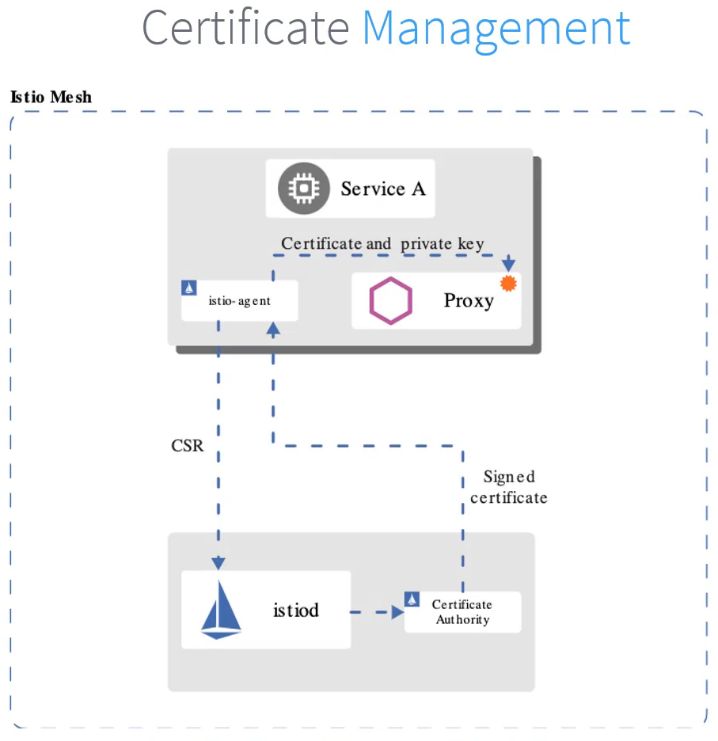

# Service Mesh  `Istio`
- This is course about service mesh which is used in microservices architecture 
- when moving from one big monolithic app to multiple smaller microservices apps we need to implement things like networking and logging tracing authentication etc
- In this point we need to use service mesh 

## Definition
- It is dedicated and configured infra layer that handel communication between service and without having to change code in micro services apps.
- Components:
    - Data Plane: Proxy, Envoy
    - Control Plane
- Features:
    - Traffic management: how service talk to each others
    - Security 
    - Service Discovery: health check, Discovery and load Balancing
    - Observability

## Service Mesh Tool *Istio*
- Components:
    - Data Plane `sidecar`: Envoy, Istio Agent (Passing config secrets to envoy proxy)
    - Control Plane `Istiod`: 
        - Citadel: Manage cert generation 
        - Pilot: help with service discovery
        - Galley:  validating config files 

## Installation Istio
- Using Helm: [here](https://istio.io/latest/docs/setup/install/helm/)
- Using Istioctl: [here](https://istio.io/latest/docs/setup/install/istioctl/)

### Enable istio in k8s cluster Commands
```bash
istioctl version
istioctl install --set profile=demo -y
istioctl analyze
kubectl label namespace default istio-injection=enabled                 # To enable istio injection to ns

```

## Visualizing Service Mesh with Kiali
- Kiali used for observation of microservice and connections
- visualize topology request routing/rates and latency 

sudo socat TCP-LISTEN:20002,fork TCP:localhost:20001


## Traffic Management
### Gateway
- Allows external traffic (from outside the cluster) to access services inside the mesh.
- Works in combination with a VirtualService to route traffic based on hostname, path
- Separates the L4/L5 network routing (handled by the Gateway) from the L7 routing (handled by VirtualServices).
```yaml
apiVersion: networking.istio.io/v1
kind: Gateway
metadata:
  name: my-gateway
  namespace: some-config-namespace
spec:
  selector:
    app: my-gateway-controller
  servers:
  - port:
      number: 80
      name: http
      protocol: HTTP
    hosts:
    - uk.bookinfo.com
    - eu.bookinfo.com
    tls:
      httpsRedirect: true # sends 301 redirect for http requests
  

```
### Virtual Services
- A VirtualService defines a set of traffic routing rules to apply when a host is addressed. Each routing rule defines matching criteria for traffic of a specific protocol. 
```yaml
apiVersion: networking.istio.io/v1
kind: VirtualService
metadata:
  name: reviews-route
spec:
  hosts:
  - reviews.prod.svc.cluster.local
  http:
  - name: "reviews-v2-routes"
    match:
    - uri:
        prefix: "/wpcatalog"
    - uri:
        prefix: "/consumercatalog"
    rewrite:
      uri: "/newcatalog"
    route:
    - destination:
        host: reviews.prod.svc.cluster.local
        subset: v2
      weight: 99
  - name: "reviews-v1-route"
    route:
    - destination:
        host: reviews.prod.svc.cluster.local
        subset: v1
      weight: 1
```
### Destination
- 
```yaml
apiVersion: networking.istio.io/v1alpha3
kind: DestinationRule
metadata:
  name: reviews-destination
spec:
  host: reviews.prod.svc.cluster.local
  subsets:
  - name: v1
    labels:
      version: v1
  - name: v2
    labels:
      version: v2
```

### Fault Injection & TimeOut

- `Fault Injection`: shows you how to inject faults to test the resiliency of your application.
- `Timeout`: show to set up request timeouts in Envoy using Istio.
```yaml
  http:
  - fault:
      delay:
        percentage:
          value: 100
        fixedDelay: 2s
```

-` Retries:` A retry setting specifies the maximum number of times an Envoy proxy attempts to connect to a service if the initial call fails.
```yaml
  http:
  - route:
    - destination:
        host: ratings
        subset: v1
    retries:
      attempts: 3
      perTryTimeout: 2s
```
- `Circuit Breaker` is implemented via the DestinationRule resource by configuring connection pool settings and outlier detection.
    - Protects your services from being overwhelmed by too many requests.
    - Improves stability by quickly failing fast when a service is unhealthy. 
```yaml
apiVersion: networking.istio.io/v1
kind: DestinationRule
metadata:
  name: reviews
spec:
  host: reviews
  subsets:
  - name: v1
    labels:
      version: v1
    trafficPolicy:
      connectionPool:
        tcp:
          maxConnections: 100
```

## Security
- Istio applies the narrowest matching policy for each workload using the following order:
  - workload-specific
  - namespace-wide
  - mesh-wide
---

---
### Authentication policies
```yaml
apiVersion: security.istio.io/v1
kind: PeerAuthentication
metadata:
  name: "example-peer-policy"
  namespace: "foo"
spec:
  selector:
    matchLabels:
      app: reviews
  mtls:
    mode: STRICT
```
- MTLS Mode:
  - `PERMISSIVE`: Workloads accept both mutual TLS and plain text traffic
  - `STRICT`: Workloads only accept mutual TLS traffic.

### Authorization 
- The authorization policy enforces access control to the inbound traffic in the server side Envoy proxy. Each Envoy proxy runs an authorization engine that authorizes requests at runtime.
```yaml
apiVersion: security.istio.io/v1
kind: AuthorizationPolicy
metadata:
 name: httpbin
 namespace: foo
spec:
 selector:
   matchLabels:
     app: httpbin
     version: v1
 action: ALLOW
 rules:
 - from:
   - source:
       principals: ["cluster.local/ns/default/sa/curl"]
   - source:
       namespaces: ["dev"]
   to:
   - operation:
       methods: ["GET"]
   when:
   - key: request.auth.claims[iss]
     values: ["https://accounts.google.com"]
```
### Certification  Management 


## Observation

###